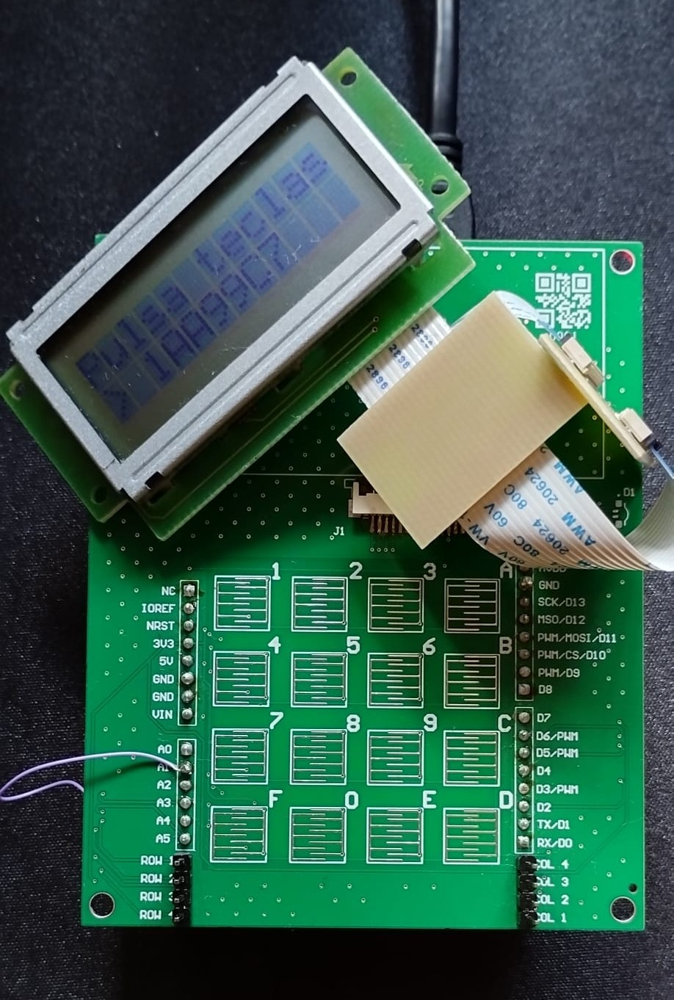

# NUCLEO-STM32 expansion board


## Author

* **Carlos Blanco Sevilla** - email: [c.bsevilla@alumnos.upm.es](mailto:alumno@alumno.es)


**Proyect based on the creation of an expansion board for new functionalities for the NUCLEO-STM32 dev board using C**
This is a TFG proyect devoted to the development of a new expansion board compatible with multiple dev borads with Arduino pins.
Its main function is to print the pressed keys located at the board's body on the liquid cristal display.

**Image of the fisrt iteration of the board:**




**Demonstration video**


```markdown
[![Click para ir al vídeo]](https://youtu.be/GKOu6acFRMo)
```